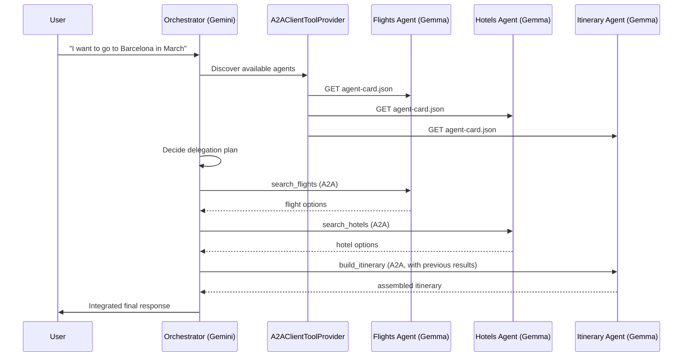

# Strands Agents - A2A - Multi-Agent Trip Planner

## Introducción

Este caso de uso muestra de A2A: **descubrimiento dinámico de agentes**. Acá el orquestador no tiene hardcodeado a qué endpoint le habla — usa `A2AClientToolProvider` para descubrir en runtime qué agentes remotos están disponibles, leer sus *agent cards* (nombre, descripción, skills) y decidir en lenguaje natural a cuál delegar cada parte de la tarea.

El escenario: un usuario le pide a un asistente de viajes algo como *"Quiero ir a Barcelona en marzo"*. Esa consulta no la resuelve un solo agente — se descompone en subtareas que atienden tres especialistas distintos, cada uno corriendo como su propio servidor A2A local (Gemma vía Ollama): uno busca vuelos, otro hoteles, y un tercero arma el itinerario final combinando lo que devolvieron los dos anteriores.

## Caso de uso

Un asistente de viajes recibe una consulta abierta del usuario y coordina tres agentes especializados para armar una respuesta completa:

- **Flights Agent**: expone la skill `search_flights` — busca opciones de vuelos según origen, destino y fecha.
- **Hotels Agent**: expone la skill `search_hotels` — busca alojamiento según destino y fechas.
- **Itinerary Agent**: expone la skill `build_itinerary` — combina vuelos y hoteles encontrados en un itinerario coherente día por día.

**Ejemplo de interacción:**

- *"Quiero ir a Barcelona en marzo, 5 días"* → el orquestador descubre los tres agentes disponibles, delega la búsqueda de vuelos y hoteles, y finalmente delega en el Itinerary Agent el armado de la propuesta final con los resultados de los dos anteriores.

## Cómo funciona

El caso corre como **cuatro procesos independientes**: tres servidores A2A (cada uno con un agente especialista Gemma vía Ollama) y un orquestador (Gemini) que los descubre y les habla por la red. La diferencia clave con el caso `privacy-aware-routing` es que el orquestador **no sabe de antemano** quiénes son los especialistas ni dónde viven: lo averigua en runtime leyendo los agent cards. A continuación, qué hace cada módulo del proyecto.

### `remote_agents/flights_server.py`, `hotels_server.py`, `itinerary_server.py`

Cada uno levanta un **servidor A2A** con `A2AServer`, en su propio proceso y su propio puerto (`9001`, `9002`, `9003`). Igual que en el caso anterior, en lugar de pasarle un único `Agent` se le pasa una **fábrica** (`agent_factory=create_agent`): el servidor la invoca una vez por cada `context_id` (cada conversación) y reutiliza ese agente para los siguientes mensajes de esa misma conversación, de modo que dos conversaciones nunca comparten historial. El agente corre **Gemma vía Ollama** (`OllamaModel`) con temperatura baja, y se le entrega **una sola tool** (la de su especialidad).

A cada servidor se le pasa una **`skills=[...]`** con un `AgentSkill`. Para el *discovery*: el `AgentSkill` (nombre + descripción) es lo que el orquestador ve cuando lista los agentes disponibles, sin ningún mapeo hardcodeado del lado del orquestador. → Cada server publica automáticamente su **agent card** en `/.well-known/agent-card.json`.

### `remote_agents/travel_tools.py` 

Son las **tools con las que los especialistas obtienen los datos**, en vez de inventarlos con el LLM. Hay tres, decoradas con `@tool`: `search_flights` (vuelos por origen/destino/mes), `search_hotels` (alojamiento por destino/noches) y `get_destination_highlights` (puntos de interés del destino). En este demo leen de "bases de datos" en memoria con datos fijos (por ejemplo, destinos `barcelona`, `lisbon`, `tokyo`); en un sistema real, cada tool consultaría sistemas externos (un GDS o agregador de vuelos, una API de reservas de hoteles, una base de puntos de interés). El system prompt de cada agente le indica usar **siempre** su tool y no inventar datos. Cada llamada queda registrada en el log (`TOOL CALL: search_flights(...)`).

> **Nota sobre modelos locales chicos:** `gemma4:e2b-it-qat` (2B efectivos) soporta *function calling*, pero al ser un modelo tan liviano el uso de tools es **intermitente**: con el mismo prompt, a veces invoca la tool y a veces responde sin ella. 

> IMPORTANTE!! Para esta Prueba de concepto, las tools tienen las opciones de destinos hardcode pero podés crear herramientas via mcp o APIs.

### `orchestrator/main.py`

Es el punto de entrada. Crea un `Agent` de Strands con **Gemini vía `LiteLLMModel`** y lo equipa con las tools de un **`A2AClientToolProvider`**. Ese provider se construye una única vez con `known_agent_urls` (la lista de servidores A2A a visualizar) y expone tres tools de discovery/delegación:

- `a2a_list_discovered_agents` — lista los agentes disponibles con su nombre, descripción y skills (su agent card).
- `a2a_discover_agent` — trae el agent card de una URL puntual.
- `a2a_send_message` — envía una tarea a un agente específico (por su URL exacta) y devuelve la respuesta.

El system prompt le indica el flujo: **primero descubrir** (listar agentes y leer sus skills), después mapear cada parte del pedido al especialista correcto y **delegar** con `a2a_send_message`. La respuesta al usuario se muestra **en streaming**. El modelo se configura con `num_retries=2`, para que LiteLLM reintente ante errores transitorios de la API (por ejemplo `503`/`429` por saturación).

### `common/`

Módulo compartido por todos los procesos:
- **`prompts.py`** — los system prompts del orquestador y de los tres especialistas, como única fuente de verdad.
- **`config.py`** — carga y valida el `.env` (falla temprano si falta la API key). Acá vive la lista de URLs de especialistas (`SPECIALIST_AGENT_URLS`) que el orquestador le pasa al provider para el discovery.

| Archivo | Qué carga? |
|---|---|
| `remote_agents/flights_server.py` | `load_flights_config` |
| `remote_agents/hotels_server.py` | `load_hotels_config` |
| `remote_agents/itinerary_server.py` | `load_itinerary_config` |
| `orchestrator/main.py` | `load_orchestrator_config` |
| `evals/judge.py` | `load_judge_config` |

- **`logging_config.py`** — logging a consola y archivo, separado por proceso (`orchestrator.log`, `flights_server.log`, `hotels_server.log`, `itinerary_server.log`).

### Respuesta en streaming en main.py (`stream_async`)

El orquestador imprime la respuesta token a token con `stream_async` en vez de `orchestrator(query)`, más natural para un chat. Por eso el agente se crea con `callback_handler=None`: si no, Strands imprimiría el stream por su cuenta y la respuesta saldría duplicada.


## Arquitectura



**Cuatro procesos independientes corriendo en paralelo:**

```plaintext
┌───────────────────────────────┐
│  orchestrator/main.py         │
│  Agent (Strands) + Gemini     │
│  A2AClientToolProvider        │
└───────┬───────────┬───────────┘
        │           │           │
        │ A2A/HTTP   │           │
        ▼           ▼           ▼
┌──────────────┐┌──────────────┐┌──────────────┐
│flights_server││hotels_server ││itinerary_srv │
│A2AServer     ││A2AServer     ││A2AServer     │
│Gemma/Ollama  ││Gemma/Ollama  ││Gemma/Ollama  │
│:9001         ││:9002         ││:9003         │
└──────────────┘└──────────────┘└──────────────┘
```

El flujo de discovery + delegación:

➡ El orquestador recibe la consulta abierta y llama a `a2a_list_discovered_agents`: ahí es donde entra en juego el concepto de *agent card* que en el caso anterior mencionamos solo de paso. Acá es el mecanismo real que le permite decidir a quién delegar cada subtarea, sin tener el mapeo hardcodeado.

➡ Con las skills descubiertas, delega la búsqueda de **vuelos** y de **hoteles** (subtareas independientes). Solo cuando tiene ambos resultados, se los pasa al **Itinerary Agent** (que depende de los dos anteriores) para que arme la propuesta día por día.

➡ Finalmente integra las tres respuestas en una única contestación para el usuario.

## Estructura del proyecto

``` plaintext
multi-agent-trip-planner/
├── README.md
├── requirements.txt
├── pytest.ini
├── .env.example
├── common/                       # shared by every process
│   ├── prompts.py                # system prompts (orchestrator + 3 specialists)
│   ├── config.py                 # loads/validates the .env + discovery URL list
│   └── logging_config.py         # console + file logging per process
├── remote_agents/
│   ├── travel_tools.py           # mock travel tools with fixed data
│   ├── flights_server.py         # A2AServer with Gemma (port 9001)
│   ├── hotels_server.py          # A2AServer with Gemma (port 9002)
│   └── itinerary_server.py       # A2AServer with Gemma (port 9003)
├── orchestrator/
│   └── main.py                   # Gemini + A2AClientToolProvider
├── tests/
│   ├── conftest.py               # sys.path + loads .env for tests
│   ├── test_discovery.py         # does the orchestrator discover before delegating?
│   └── test_a2a_integration.py   # self-contained integration test (starts the 3 servers)
├── evals/
│   ├── judge.py                  # LLM judge (Gemini via LiteLLM, not Bedrock)
│   ├── dataset.py                # loads test cases from the .jsonl files
│   ├── report_io.py              # saves each report as JSON under outputs/
│   ├── cases_discovery.jsonl     # discovery/delegation test cases (data, not code)
│   ├── cases_response_quality.jsonl # response-quality test cases (data)
│   ├── eval_discovery.py         # deterministic discovery eval (ToolCalled)
│   ├── eval_response_quality.py  # LLM-judge eval (correctness + faithfulness rubrics)
│   └── outputs/                  # saved eval reports as JSON (gitignored)
└── logs/
    └── .gitkeep                  # run logs land here (gitignored)
```

## 💻 Ejecución Local

### 1. Requisitos Previos e Instalación

El proyecto está en Python y se requiere mínimo **Python 3.12 o superior**.

1. Clonar el repositorio:

```bash
git clone https://github.com/reinalau/strands-a2a-patterns
cd strands-a2a-patterns/multi-agent-trip-planner
```

### 2.1. Requisito para ejecución con la API de Gemini

Ingresar con una cuenta de Gmail a https://aistudio.google.com/ y generar una API key:

https://aistudio.google.com/api-keys

La capa gratuita se puede utilizar con:
gemini-3.6-flash
gemini-3.5-flash-lite

(o las que te permita tu cuenta)

### 2.2. Requisito para ejecución con Docker - Ollama y gemma4:e2b-it-qat

1. Tener Docker Desktop instalado y corriendo.

2. **Primera vez:** crear y levantar el servidor de Ollama con un volumen persistente:

```bash
docker run -d --name ollama -p 11434:11434 -v ollama_data:/root/.ollama ollama/ollama
```
*(Si el contenedor ya fue creado previamente y está detenido, alcanza con `docker start ollama`)*

> **Nota sobre paralelismo real:** este caso levanta **tres** agentes remotos que pueden recibir requests casi simultáneos (el orquestador dispara la búsqueda de vuelos y hoteles una tras otra). Por default, Ollama procesa un request de inferencia a la vez (`OLLAMA_NUM_PARALLEL=1`), así que si querés que las llamadas concurrentes se ejecuten en paralelo real, recreá el contenedor con la variable seteada:
> ```bash
> docker stop ollama && docker rm ollama
> docker run -d --name ollama -p 11434:11434 -v ollama_data:/root/.ollama -e OLLAMA_NUM_PARALLEL=3 ollama/ollama
> ```
> Tené en cuenta que esto multiplica el uso de RAM/VRAM.

3. Descargar el modelo (solo la primera vez; con el volumen montado, queda guardado):

```bash
docker exec -it ollama ollama pull gemma4:e2b-it-qat
```

4. Probar que el modelo responde interactivamente:

```bash
docker exec -it ollama ollama run gemma4:e2b-it-qat
```
Interactuar diciendo al menos "hola" y verificar si contesta. Para salir presionar `Ctrl + d` o escribir `/bye`.

5. Verificar que el modelo está activo en memoria:

```bash
docker exec -it ollama ollama ps
```

### 3. Instalación de dependencias y variables de entorno

**1. Crear y activar un entorno virtual.**

```bash
python -m venv .venv
```

Activar entorno según tu terminal:

```bash
# Git Bash (MINGW)
source .venv/Scripts/activate

# PowerShell
.\.venv\Scripts\Activate.ps1

# Linux / macOS
source .venv/bin/activate
```

**2. Instalar las dependencias (revisar!).**

```bash
pip install -r requirements.txt
```


A2A está en `strands-agents-tools`, que trae el **`A2AClientToolProvider`**: el cliente de discovery dinámico que usa el orquestador para encontrar y llamar a los especialistas en runtime.

**3. Configurar las variables de entorno.**

```bash
cp .env.example .env
```

Editá `.env` y completá al menos:

| Variable | Qué poner |
|---|---|
| `GEMINI_API_KEY` | Tu API key de Google AI Studio (ver paso 2.1). |
| `ORCHESTRATOR_MODEL_ID` | El modelo de Gemini con prefijo `gemini/`, por ejemplo `gemini/gemini-3.5-flash-lite`. El prefijo le indica a LiteLLM el proveedor. |
| `REMOTE_MODEL_ID` | El modelo local; por defecto `gemma4:e2b-it-qat`. |

El resto (`OLLAMA_HOST`, los `*_HOST`/`*_PORT` de cada especialista, `SPECIALIST_AGENT_URLS`, `LOG_LEVEL`) ya viene con valores por defecto que funcionan para una corrida local; tocalos solo si cambiás puertos o host. `SPECIALIST_AGENT_URLS` es opcional: si lo dejás sin setear, se arma solo a partir de los puertos de los especialistas.

### 4. Pruebas (`tests/`)

Los tests están organizados en dos niveles. Algunos tests se **saltean automáticamente** (aparecen como `SKIPPED`) si no están dadas sus condiciones.

**Prerrequisito común:** tener el entorno virtual activado y las dependencias instaladas (sección 3). 

- **`test_discovery.py`** (capa unitaria):
  - *Wiring de tools* — hace una llamada **real a Gemini** para construir el orquestador, verifica que quedó equipado con las tres tools de discovery/delegación (`a2a_list_discovered_agents`, `a2a_discover_agent`, `a2a_send_message`), sin red hacia los especialistas.
  - *Comportamiento de discovery del orquestador* — hace una llamada **real a Gemini** y mockea la red A2A del provider (no hace falta levantar los servidores); verifica que, ante un pedido de viaje, el orquestador **primero descubre** (`a2a_list_discovered_agents`) y después **delega** (`a2a_send_message`). 
- **`test_a2a_integration.py`** (integración real, autocontenido): valida el discovery de los tres agent cards y el roundtrip A2A completo contra un especialista. **No hace falta levantar los servers a mano**: una *fixture* de pytest arranca los tres como subprocesos en puertos de test propios y los baja al terminar. Solo necesita **Ollama corriendo con el modelo** descargado; si los servers no llegan a levantarse dentro del timeout (por ejemplo, Ollama apagado), los tests se saltean en vez de fallar. Este test tarda un rato porque incluye una inferencia real de Gemma en local.

```bash
# 1) Discovery tests (require a valid GEMINI_API_KEY in .env; otherwise skipped):
pytest tests/test_discovery.py -v

# 2) Integration test (starts the 3 servers by itself; requires Ollama running):
pytest tests/test_a2a_integration.py -v

# 3) All together:
pytest -v
```

> **Si ves `SKIPPED`:** revisá el motivo que imprime pytest. "Requires a real GEMINI_API_KEY" → falta configurar el `.env`. "The A2A servers did not all come up..." → falta levantar Ollama (sección 2.2).

> Los tests de integración uede tardar varios minutos. Con una notebook de capacidad pequeña, tardó 9 minutos. Mirar las constantes en dentro del codigo. 

### 5. 🤖 EJECUCION REAL DEL CASO DE USO

Se ejecutan **cuatro procesos**: los tres agentes especialistas (servidores A2A) y el orquestador. Necesitás **cuatro terminales**, y en todas el entorno virtual activado (`source .venv/Scripts/activate`).

**Prerrequisitos:** Ollama corriendo con el modelo descargado (sección 2.2) y el `.env` configurado (sección 3). El orden de arranque de los servidores no importa, pero los tres deben estar activos antes de lanzar el orquestador.

**Terminales 1, 2 y 3 — levantar los tres especialistas (una terminal por servidor):**

```bash
# Terminal 1
python -m remote_agents.flights_server

# Terminal 2
python -m remote_agents.hotels_server

# Terminal 3
python -m remote_agents.itinerary_server
```

En cada una esperar ver en el log que el servidor arrancó y publicó su agent card, por ejemplo:

```
INFO | flights_server | Starting Flights A2AServer at http://127.0.0.1:9001 (local model: gemma4:e2b-it-qat ...)
INFO | flights_server | Agent card available at http://127.0.0.1:9001/.well-known/agent-card.json
INFO | Uvicorn running on http://127.0.0.1:9001
```

Podés inspeccionar cualquier agent card, ejemplo:

```bash
curl http://127.0.0.1:9001/.well-known/agent-card.json
```

**Terminal 4 — ejecutar el orquestador.** Dos modos:

```bash
# Interactive mode (console chat; type 'exit' to quit):
python -m orchestrator.main

# One-shot mode (a single query as an argument):
python -m orchestrator.main "Quiero ir a Barcelona en marzo, 5 dias"
```

**Qué observar — el discovery y la delegación:**

En Terminal 4 vas a ver primero que el orquestador **lista los agentes** disponibles (discovery), y después las delegaciones a cada especialista. 

→ Para salir del modo chat: exit (o quit / salir) en el prompt You> y Enter.
→ Para salir de los Server: ctrol + y Enter.

### 6. Logs

Cada corrida escribe logs en  `logs/`, separados por proceso, para seguir el intercambio A2A paso a paso:

- **`logs/orchestrator.log`**: qué agentes descubrió, qué plan de delegación armó, y en qué orden invocó a cada uno.
- **`logs/flights_server.log`**, **`logs/hotels_server.log`**, **`logs/itinerary_server.log`**: requests A2A recibidos por cada agente especialista — la creación del agente por `context_id` y las `TOOL CALL` que ejecuta Gemma.

El nivel se controla con `LOG_LEVEL` en el `.env` (`INFO` por defecto; `DEBUG` muestra más detalle). 

### 7. Evaluaciones (`evals/`)

- **Determinísticos** (código puro, sin LLM): rápidos y baratos, ideales para CI.
- **LLM-as-a-judge**: un modelo puntúa cualidades más subjetivas (correctitud, fidelidad) con una rúbrica.

> **Nota sobre el juez:** por defecto el SDK usa Amazon Bedrock (Claude) como juez. Como este proyecto es "sin cuenta de AWS", el juez se configura para usar **Gemini vía LiteLLM** (ver `evals/judge.py`), reutilizando la misma `GEMINI_API_KEY` del `.env`.

**`evals/eval_discovery.py` — la decisión de discovery + delegación (determinístico).** Es el corazón del patrón A2A dinámico: ¿el orquestador descubre los agentes antes de delegar, y delega efectivamente en los especialistas? Corre el orquestador real, captura qué tools llamó y verifica esa trayectoria con evaluadores de código (`ToolCalled`): que aparezca `a2a_list_discovered_agents` (descubrió) y `a2a_send_message` (delegó). Mockea la red A2A del provider, así que no necesita los servidores levantados — acá solo importa la *decisión* del modelo (se requiere `GEMINI_API_KEY`).

**`evals/eval_response_quality.py` — la calidad de la respuesta (LLM-judge).** Ejecuta el flujo A2A completo (orquestador → discovery → especialistas Gemma con sus tools) y puntúa la respuesta final con dos `OutputEvaluator` (rúbricas custom), usando Gemini como juez:
- Correctness → ¿la respuesta incluye datos que coinciden con la referencia (vuelo/hotel/itinerario esperado)?
- Faithfulness → ¿la respuesta se apoya en los datos de las tools y **no inventa ni evade**?

Esto mide el modo de falla que puede suceder con un modelo local chico (ejemplo: a veces inventa un vuelo en lugar de usar la tool). Levanta los tres servidores A2A solo (subprocesos), así que además de la API key requiere **Ollama corriendo**.

```bash
# Discovery eval (fast, no servers needed; requires GEMINI_API_KEY):
python -m evals.eval_discovery

# Response-quality eval (starts the 3 servers by itself; requires Ollama + GEMINI_API_KEY):
python -m evals.eval_response_quality
```

Cada ejecución imprime un reporte con el puntaje por caso, la razón del juez y la tasa de aprobación, y  **lo guarda como JSON** en `evals/outputs/` (`discovery_list_<timestamp>.json` - `discovery_delegate_<timestamp>.json`  y `response_quality_<timestamp>.json`).

Los **casos de prueba** están en `evals/cases_discovery.jsonl` y `evals/cases_response_quality.jsonl` (un caso JSON por línea). `evals/dataset.py` los carga.

Nota: Podés sumar otros evaluadores del SDK según lo que se quiera medir, como  `HelpfulnessEvaluator` (utilidad al usuario), `ToolParameterAccuracyEvaluator`, entre otros.

## Referencias

- [Strands Agents — Agent-to-Agent (A2A) Protocol](https://strandsagents.com/docs/user-guide/concepts/multi-agent/agent-to-agent/)
- [Strands Agents Tools — A2A Client](https://github.com/strands-agents/tools)
- [A2A Protocol — Documentación oficial](https://a2aproject.github.io/A2A/latest/)
- [A2A GitHub Organization](https://github.com/a2aproject/A2A)
- [Ollama — Gemma 4](https://ollama.com/library/gemma4)
- [Strands Evals SDK — Quickstart](https://strandsagents.com/docs/user-guide/evals-sdk/quickstart/)
- [Artículo relacionado](https://builder.aws.com/content/3IEOXhwX9PxCQwxhggtL5jsD1WJ/a2a-en-strands-agentes-remotos-con-routing-deterministico-y-discovery-dinamico)


## Licencia

Este proyecto está bajo la Licencia MIT. Consultá el archivo [LICENSE](LICENSE) para más detalles.
