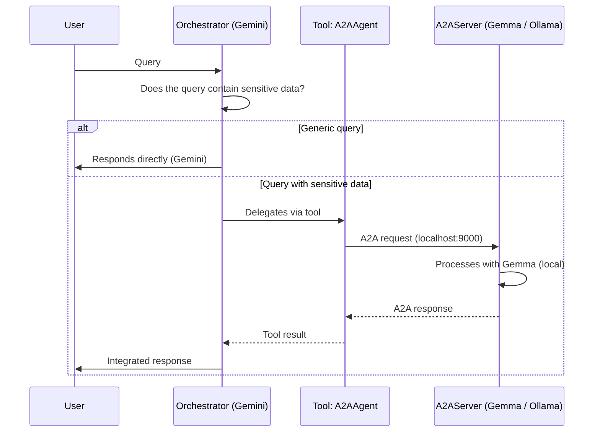

# Strands Agents - A2A - Privacy Aware Routing


## Introducción

Este es un proyecto educativo que muestra un patron sencillo para utilizar A2A con Strands:
 **ruteo determinístico hacia un único agente remoto**, sin discovery dinámico ni protocolos de negociación.

El escenario: un asistente de atención al cliente **de una entidad financiera (un banco)** atiende consultas de usuarios. La mayoría son genéricas (horarios, políticas, información pública) y las resuelve directamente el orquestador con Gemini vía API. Pero cuando la consulta involucra datos sensibles (DNI, número de cuenta o tarjeta, CBU/CVU, saldos, etc.), el orquestador detecta esa condición y delega esa porción del trabajo a un **agente A2A que corre 100% local** (Gemma vía Ollama), sin que esa información sensible salga nunca de la máquina del usuario.

El caso de uso visualiza una decisión de arquitectura que enfrenta cualquier equipo que quiere aprovechar un LLM en la nube por su calidad, pero tiene restricciones de compliance, privacidad o soberanía de datos sobre parte de la información que procesa. 

## Caso de uso

Un asistente de atención al cliente **de una entidad financiera (un banco)** recibe consultas de usuarios finales. El orquestador (Gemini) analiza cada consulta entrante y decide, según su contenido, si puede resolverla directamente o si detecta datos sensibles que ameritan delegarla al agente local (Gemma vía Ollama, expuesto como servidor A2A).

**Ejemplos de interacción:**

- *"¿Cuál es el horario de atención?"* → resuelto directamente por Gemini, sin delegación.
- *"Quiero consultar el saldo de mi cuenta 1234-5678-9"* → detectado como sensible, delegado al agente A2A local.


## Cómo funciona

El caso corre como **dos procesos independientes**: un servidor A2A que expone un agente local (Gemma vía Ollama) y un orquestador (Gemini) que le habla a ese servidor a través de la red cuando hace falta. La decisión clave — resolver directo o delegar — la toma el orquestador en cada turno según el contenido de la consulta. A continuación, qué hace cada módulo del proyecto.

### `remote_agent/server.py`

Levanta el **servidor A2A** con `A2AServer`. En lugar de pasarle un único `Agent`, le pasa una **fábrica** (`agent_factory=create_agent`): el servidor la invoca una vez por cada `context_id` (cada conversación) y reutiliza ese agente para los siguientes mensajes de esa misma conversación, de modo que dos conversaciones nunca comparten historial. El agente que fabrica corre **Gemma vía Ollama** (`OllamaModel`), con temperatura baja para respuestas sobrias en un contexto sensible, y se le entregan las **tools del banco** (ver abajo). Al arrancar, el servidor publica automáticamente su **agent card** en `/.well-known/agent-card.json` y atiende requests A2A (JSON-RPC) en `http://localhost:9000`.

### `remote_agent/bank_tools.py`

Son las **tools con las que el agente local obtiene los datos** de las cuentas, en vez de inventarlos con el LLM. Hay tres, decoradas con `@tool`: `get_account_balance` (saldo), `get_last_transactions` (últimos movimientos) y `get_account_holder` (titular y tipo de cuenta). 
En este demo leen de un pequeño "banco" en memoria con datos fijos (por ejemplo, la cuenta `1234-5678-9` es de Laura Bolaños); en un sistema real, cada tool consultaría los sistemas internos del banco (core bancario, procesador de tarjetas, CRM). El system prompt del agente le indica usar **siempre** la tool correspondiente y no inventar datos: así el saldo que devuelve sale de una fuente determinística, no de la imaginación del modelo. 
Cada llamada queda registrada en el log (`TOOL CALL: get_account_balance(...)`), lo que permite auditar qué tool se usó en cada consulta.

> **Nota sobre modelos locales chicos:** `gemma4:e2b-it-qat` (2B efectivos) soporta *function calling*, pero al ser un modelo tan liviano el uso de tools es **intermitente**: con el mismo prompt, a veces invoca la tool y a veces responde sin ella. Es una limitación esperable de correr un modelo pequeño en local. Modelos algo más grandes (por ejemplo `gemma4:e4b-it-qat`) lo hacen de forma más consistente, a costa de más RAM y latencia.

### `orchestrator/main.py`

Es el punto de entrada. Crea un `Agent` de Strands con **Gemini vía `LiteLLMModel`** y le da como única herramienta a `handle_sensitive_query`. Su system prompt le indica cuándo usarla: si la consulta es genérica, responde él mismo; si detecta datos sensibles, delega. La respuesta al usuario se muestra **en streaming** (ver más abajo). El modelo se configura con `num_retries=2`, para que LiteLLM reintente ante errores transitorios de la API (por ejemplo `503`/`429` por saturación).

### El tool `handle_sensitive_query`

Es el puente hacia el agente remoto. Envuelve un **`A2AAgent`** que apunta a `http://localhost:9000`; cuando el orquestador lo invoca, el `A2AAgent` arma el request A2A, se lo manda al servidor remoto y devuelve la respuesta como si fuera un agente local. Toda la complejidad del protocolo (resolver el agent card, HTTP, JSON-RPC) queda oculta detrás de esa abstracción: desde el orquestador, delegar a un proceso remoto se ve igual que llamar a una función.

### `common/`

Módulo compartido por ambos procesos, para no duplicar código:
- **`prompts.py`** — los system prompts del orquestador y del agente remoto, como única fuente de verdad.
- **`config.py`** — carga y valida el `.env` (falla temprano si falta la API key).
| Archivo | Qué carga? |
|---|---|
| `remote_agent/server.py` | `load_remote_agent_config` |
| `scripts/probe_tool_calling.py` | `load_remote_agent_config` |
| `orchestrator/main.py` | `load_orchestrator_config` |
| `evals/judge.py` | `load_judge_config` (el que agregué recién) |

- **`logging_config.py`** — logging a consola y archivo, separado por proceso (`orchestrator.log`, `remote_agent.log`).

### Los dos caminos del ruteo

➡ **Consulta genérica** (p. ej. horarios): Gemini la resuelve directamente, sin ningún salto A2A.

➡ **Consulta sensible** (p. ej. un saldo de cuenta): el orquestador llama a `handle_sensitive_query`, que dispara el request A2A al agente local; la respuesta de Gemma vuelve como resultado del tool y el orquestador la integra a su contestación final. El dato sensible nunca sale de la máquina.

### Respuesta en streaming (`stream_async`)

El orquestador no invoca al agente de la forma más directa (`orchestrator(query)`, que devolvería la respuesta completa de una vez), sino con **`stream_async`**, que expone el flujo de eventos a medida que ocurren para imprimir la respuesta token a token — más natural para un asistente conversacional. El patrón, en `run_once`, es mirar dos tipos de evento:

```python
response = ""
async for event in orchestrator.stream_async(query):
    if "data" in event:                 # cada chunk de texto generado
        print(event["data"], end="", flush=True)
    elif "result" in event:             # evento final con el AgentResult
        response = event["result"].message["content"][0]["text"]
```

`event["data"]` trae cada fragmento de texto en cuanto se genera (lo imprimimos al vuelo con `flush=True`); `event["result"]` es el evento final con el `AgentResult` completo, del que extraemos el texto total y lo **retornamos** (así `run_once` sigue devolviendo un string, útil para tests). Por eso el agente se crea con **`callback_handler=None`**: si dejáramos el handler por defecto de Strands, imprimiría el stream por su cuenta y veríamos la respuesta duplicada. Esto vuelve async todo el pipeline (`run_once`, el loop interactivo y `main`), con `asyncio.run(main())` como entrypoint.


## Arquitectura



**Dos procesos independientes corriendo en paralelo:**

```plaintext
┌──────────────────────────────┐      A2A / HTTP       ┌──────────────────────────────┐
│  orchestrator/main.py        │ ────────────────────► │  remote_agent/server.py      │
│  Agent (Strands) + Gemini    │                       │  A2AServer + Gemma (Ollama)  │
│  Tool: A2AAgent wrapper      │ ◄──────────────────── │  bank tools + agent card     │
└──────────────────────────────┘     localhost:9000    └──────────────────────────────┘
           process 1                                              process 2
```


## Estructura del proyecto

``` plaintext
privacy-aware-routing/
├── README.md
├── requirements.txt
├── pytest.ini
├── .env.example
├── common/                      # shared by both processes
│   ├── prompts.py               # system prompts (orchestrator + remote agent)
│   ├── config.py                # loads/validates the .env
│   └── logging_config.py        # console + file logging per process
├── remote_agent/
│   ├── server.py                # A2AServer with Gemma (Ollama)
│   └── bank_tools.py            # mock bank tools with fixed data
├── orchestrator/
│   └── main.py                  # Gemini + A2AAgent as tool
├── tests/
│   ├── conftest.py              # sys.path + loads .env for tests
│   ├── test_routing_logic.py    # does the orchestrator delegate when it should?
│   └── test_a2a_integration.py  # self-contained integration test (starts the server)
├── evals/
│   ├── judge.py                 # LLM judge (Gemini via LiteLLM, not Bedrock)
│   ├── dataset.py               # loads test cases from the .jsonl files
│   ├── report_io.py             # saves each report as JSON under outputs/
│   ├── cases_routing.jsonl      # routing test cases (data, not code)
│   ├── cases_response_quality.jsonl # response-quality test cases (data)
│   ├── eval_routing.py          # deterministic routing eval (ToolCalled / ToolNotCalled)
│   ├── eval_response_quality.py # LLM-judge eval (correctness + faithfulness rubrics)
│   └── outputs/                 # saved eval reports as JSON (gitignored)
└── logs/
    └── .gitkeep                 # run logs land here (gitignored)
```


## 💻 Ejecución Local

### 1. Requisitos Previos e Instalación

El proyecto está en Python y se requiere mínimo **Python 3.12 o superior**.

1. Clonar el repositorio:

```bash
git clone https://github.com/reinalau/strands-a2a-patterns
cd strands-a2a-patterns/privacy-aware-routing
```

### 2.1. Requisito para ejecución con la API de Gemini

Ingresar con una cuenta de Gmail a https://aistudio.google.com/ y generar una API key:

https://aistudio.google.com/api-keys

La capa gratuita se puede utilizar con:
gemini-3.6-flash
gemini-3.5-flash-lite

(o las que te permita tu cuenta)

### 2.2. Requisito para ejecución con Docker - Ollama y gemma4:e2b-it-qat

1. Tener Docker Desktop instalado y corriendo.

2. **Primera vez:** crear y levantar el servidor de Ollama con un volumen persistente:

```bash
docker run -d --name ollama -p 11434:11434 -v ollama_data:/root/.ollama ollama/ollama
```
*(Si el contenedor ya fue creado previamente y está detenido, alcanza con `docker start ollama`)*

> **Nota:** en este caso el orquestador delega de a una consulta por vez contra un único agente remoto, así que el default de Ollama (`OLLAMA_NUM_PARALLEL=1`) es suficiente. El paralelismo real de Ollama recién importa en el caso `multi-agent-trip-planner`, donde hay tres agentes recibiendo requests simultáneos.

3. Descargar el modelo (solo la primera vez; con el volumen montado, queda guardado):

```bash
docker exec -it ollama ollama pull gemma4:e2b-it-qat
```

4. Probar que el modelo responde interactivamente:

```bash
docker exec -it ollama ollama run gemma4:e2b-it-qat
```
Interactuar diciendo al menos "hola" y verificar si contesta. Para salir presionar `Ctrl + d` o escribir `/bye`.

5. Verificar que el modelo está activo en memoria:

```bash
docker exec -it ollama ollama ps
```

### 3. Instalación de dependencias y variables de entorno

**1. Crear y activar un entorno virtual.**

```bash
python -m venv .venv
```

Activarlo según tu terminal:

```bash
# Git Bash (MINGW)
source .venv/Scripts/activate

# PowerShell
.\.venv\Scripts\Activate.ps1

# Linux / macOS
source .venv/bin/activate
```

Con el entorno activo vas a ver el prefijo `(.venv)` al principio del prompt.

**2. Instalar las dependencias.**

```bash
pip install -r requirements.txt
```

Esto instala `strands-agents` con los tres extras que usa el caso:
- `[a2a]` — servidor A2A y cliente `A2AAgent`.
- `[ollama]` — modelo local Gemma.
- `[litellm]` — orquestador Gemini.

**3. Configurar las variables de entorno.**

```bash
cp .env.example .env
```

Editá `.env` y completá al menos:

| Variable | Qué poner |
|---|---|
| `GEMINI_API_KEY` | Tu API key de Google AI Studio (ver paso 2.1). |
| `ORCHESTRATOR_MODEL_ID` | El modelo de Gemini con prefijo `gemini/`, por ejemplo `gemini/gemini-3.5-flash`. El prefijo le indica a LiteLLM el proveedor. |
| `REMOTE_MODEL_ID` | El modelo local; por defecto `gemma4:e2b-it-qat`. |

El resto (`OLLAMA_HOST`, `A2A_HOST`, `A2A_PORT`, `REMOTE_AGENT_URL`, `LOG_LEVEL`) ya viene con valores por defecto que funcionan para una corrida local; tocalos solo si cambiás puertos o host.

> **Nota sobre el modelo de Gemini:** Google va rotando qué modelos están disponibles para cuentas nuevas. Si al ejecutar el orquestador ves un error `404 ... model ... is no longer available to new users`, el propio mensaje te sugiere qué modelo usar en su lugar; actualizá `ORCHESTRATOR_MODEL_ID` en el `.env` con ese valor (siempre con el prefijo `gemini/`).

### 4. Pruebas (`tests/`)

Los tests están organizados en dos niveles, y eso mismo es contenido pedagógico para el artículo: un sistema A2A se puede testear en capas. Algunos tests se **saltean automáticamente** (aparecen como `SKIPPED`) si no están dadas sus condiciones — no es un error, es a propósito.

**Prerrequisito común:** tener el entorno virtual activado y las dependencias instaladas (sección 3). Los comandos usan `pytest` directamente, que ya viene en `requirements.txt`.

- **`test_routing_logic.py`** (capa unitaria):
  - *Tool en aislamiento* — se ejecuta **siempre**. Mockea el `A2AAgent` remoto y verifica que la tool reenvía la consulta y devuelve la respuesta, sin red ni LLM.
  - *Decisión de ruteo del orquestador* — hace una llamada **real a Gemini**, así que solo corre si tenés el `.env` configurado con una `GEMINI_API_KEY` válida (sección 3); si no, se saltea. `conftest.py` carga el `.env` automáticamente, no necesitás exportar la variable a mano.
- **`test_a2a_integration.py`** (integración real, autocontenido): valida el discovery del agent card y el roundtrip A2A completo. **No hace falta levantar el server a mano**: una *fixture* de pytest lo arranca como subproceso en un puerto de test propio y lo baja al terminar. Solo necesita **Ollama corriendo con el modelo** descargado; si el server no llega a levantarse dentro del timeout (por ejemplo, Ollama apagado), los tests se saltean en vez de fallar. Este test tarda un par de minutos porque incluye una inferencia real de Gemma en local.

```bash
# 1) Unit tests. With a valid GEMINI_API_KEY in .env, all 3 run;
#    otherwise 1 runs and 2 are skipped (the ones that call Gemini).
pytest tests/test_routing_logic.py -v

# 2) Integration test (starts the server by itself; requires Ollama running):
pytest tests/test_a2a_integration.py -v

# 3) All together:
pytest -v
```

> **Si ves `SKIPPED`:** revisá el motivo que imprime pytest. "Requires a real GEMINI_API_KEY" → falta configurar el `.env`. "The A2A server did not come up..." → falta levantar Ollama (sección 2.2).

### 5. 🤖 Ejecución real del caso de uso 

El caso corre como **dos procesos**: el agente remoto (servidor A2A) y el orquestador. Necesitás **dos terminales**, y en ambas el entorno virtual activado (`source .venv/Scripts/activate`).

**Prerrequisitos:** Ollama corriendo con el modelo descargado (sección 2.2) y el `.env` configurado (sección 3).

**Terminal 1 — levantar el agente remoto:**

```bash
python -m remote_agent.server
```

Esperá a ver en el log que el servidor arrancó y que publicó su agent card:

```
INFO | remote_agent | Starting A2AServer at http://127.0.0.1:9000 (local model: gemma4:e2b-it-qat ...)
INFO | remote_agent | Agent card available at http://127.0.0.1:9000/.well-known/agent-card.json
INFO | Uvicorn running on http://127.0.0.1:9000
```

Podés inspeccionar el agent card — el "currículum" del agente que el protocolo A2A publica automáticamente — abriéndolo en el navegador o con `curl`:

```bash
curl http://127.0.0.1:9000/.well-known/agent-card.json
```

**Terminal 2 — ejecutar el orquestador.** Dos modos:

```bash
# Interactive mode (console chat; type 'exit' to quit):
python -m orchestrator.main

# One-shot mode (a single query as an argument):
python -m orchestrator.main "¿Cuál es el horario de atención?"
```

**En la Terminal 2, probar con estas preguntas y observar los dos caminos del ruteo:**

1. **Consulta genérica** → la resuelve Gemini directamente, sin delegar:

   ```bash
   python -m orchestrator.main "¿Cuál es el horario de atención?"
   ```
   En Terminal 2 vas a ver la respuesta, y **no** va a aparecer ningún log de delegación. Terminal 1 queda en silencio.

2. **Consulta con datos sensibles** → el orquestador delega en el agente local vía A2A:

   ```bash
   python -m orchestrator.main "Quiero consultar el saldo de mi cuenta 1234-5678-9"
   ```
   Ahora sí, en Terminal 2 aparece `DELEGATING to local agent via A2A -> http://localhost:9000`, y en Terminal 1 vas a ver a Gemma procesando el request (`Creating local agent for context_id=...`). Ese es el momento exacto de la delegación A2A que vale la pena mostrar en el artículo.

**Consultas de ejemplo que disparan las tools.** Los datos del "banco" (cuentas, titulares, saldos y movimientos) están definidos en `remote_agent/bank_tools.py`. Usá alguno de estos números de cuenta para que el agente local tenga qué responder:

| Cuenta | Titular | Tool que se dispara | Ejemplo de consulta |
|---|---|---|---|
| `1234-5678-9` | Laura Bolaños | `get_account_balance` | *"Quiero consultar el saldo de mi cuenta 1234-5678-9"* |
| `1234-5678-9` | Laura Bolaños | `get_last_transactions` | *"Mostrame los últimos movimientos de la cuenta 1234-5678-9"* |
| `1234-5678-9` | Laura Bolaños | `get_account_holder` | *"¿A nombre de quién está la cuenta 1234-5678-9?"* |
| `9876-5432-1` | Martín Quiroga | `get_account_balance` | *"¿Cuál es el saldo de la cuenta 9876-5432-1?"* |

Cualquier otro número de cuenta hará que la tool responda que no la encontró. Para agregar más cuentas de prueba, editá el diccionario en `remote_agent/bank_tools.py`.

### 6. Revisando la interacción (logs)

Cada corrida escribe logs a consola **y** a archivo (bajo `logs/`), separados por proceso, para que puedas seguir el intercambio A2A paso a paso:

- **`logs/orchestrator.log`**: la consulta recibida, si el orquestador delegó o no, y la respuesta final.
- **`logs/remote_agent.log`**: la creación del agente por `context_id` y los requests A2A que atiende el servidor local con Gemma.

El nivel se controla con `LOG_LEVEL` en el `.env` (`INFO` por defecto; `DEBUG` muestra además el payload delegado). Como los logs también salen por consola, correr los dos procesos en terminales separadas te deja ver en tiempo real el momento exacto de la delegación A2A.

### 7. Evaluaciones (`evals/`)

El SDK combina dos familias de evaluadores, y este caso usa una de cada una a propósito, para mostrar ambas:

- **Determinísticos** (código puro, sin LLM): rápidos y baratos, ideales para CI.
- **LLM-as-a-judge**: un modelo puntúa cualidades más subjetivas (correctitud, fidelidad) con una rúbrica.

> **Nota sobre el juez:** por defecto el SDK usa Amazon Bedrock (Claude) como juez. Como este proyecto es "sin cuenta de AWS", el juez se configura para usar **Gemini vía LiteLLM** (ver `evals/judge.py`), reutilizando la misma `GEMINI_API_KEY` del `.env`.

**`evals/eval_routing.py` — la decisión de ruteo (determinístico).** Ejecuta el orquestador real, captura qué tools llamó y verifica esa trayectoria con evaluadores de código:
- Consulta sensible → la tool `handle_sensitive_query` **debe** aparecer (`ToolCalled`).
- Consulta genérica → esa tool **no** debe aparecer (`ToolNotCalled`, es un evaluador propio que lo hice porque la negación el SDK no lo trae).

No necesita el servidor A2A: el `A2AAgent` remoto se mockea, porque solo importa la *decisión* del modelo, no la respuesta remota (se requiere `GEMINI_API_KEY`).

**`evals/eval_response_quality.py` — la calidad de la respuesta (LLM-judge).** Ejecuta el flujo A2A completo (orquestador → A2A → Gemma con sus tools) y puntúa cada respuesta con dos `OutputEvaluator` (rúbricas custom), usando Gemini como juez:
- Correctness → ¿el valor devuelto (saldo, titular) coincide con la referencia?
- Faithfulness → ¿la respuesta se apoya en el dato de la tool y **no inventa ni evade**?

Esto mide al modo de falla que puede suceder con un modelo local chico (ejemplo: a veces inventa el saldo en lugar de usar la tool para retornarlo). Levanta el servidor A2A solo (subproceso), así que además de la API key requiere **Ollama corriendo**.

```bash
# Eval de ruteo (rápido, no necesita el server; requiere GEMINI_API_KEY):
python -m evals.eval_routing

# Eval de calidad de respuesta (levanta el server solo; requiere Ollama + GEMINI_API_KEY):
python -m evals.eval_response_quality
```

Cada ejecución imprime un reporte con el puntaje por caso, la razón del juez y la tasa de aprobación, y además **lo guarda como JSON** en `evals/outputs/`(routing_generic_yyyymmdd_hhmmss.json y response_quality_yyyymmdd_hhmmss.json)

Los **casos de prueba**: están en `evals/cases_routing.jsonl` y `evals/cases_response_quality.jsonl` (un caso JSON por línea). `evals/dataset.py` los carga.

Nota: Podés sumar otros evaluadores del SDK según lo que se quiera medir — por ejemplo `HelpfulnessEvaluator` (utilidad al usuario), `ToolParameterAccuracyEvaluator`, entre otros.

## Referencias

- [Strands Agents — Agent-to-Agent (A2A) Protocol](https://strandsagents.com/docs/user-guide/concepts/multi-agent/agent-to-agent/)
- [A2A Protocol — Documentación oficial](https://a2aproject.github.io/A2A/latest/)
- [A2A GitHub Organization](https://github.com/a2aproject/A2A)
- [Ollama — Gemma 4](https://ollama.com/library/gemma4)
- [Strands Evals SDK — Quickstart](https://strandsagents.com/docs/user-guide/evals-sdk/quickstart/)
- Artículo relacionado: *(link al artículo del blog cuando esté publicado)*

## Licencia

Este proyecto está bajo la Licencia MIT. Consultá el archivo [LICENSE](LICENSE) para más detalles.